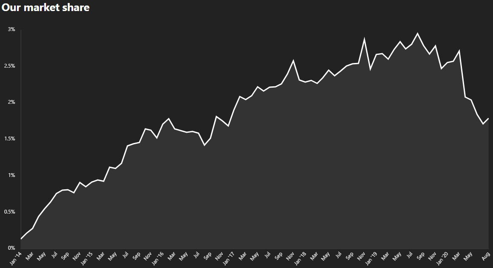
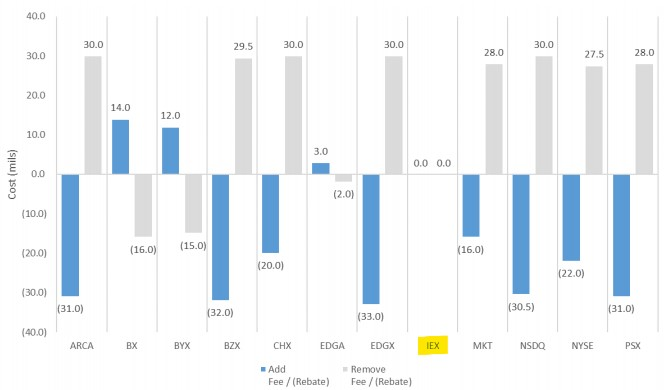
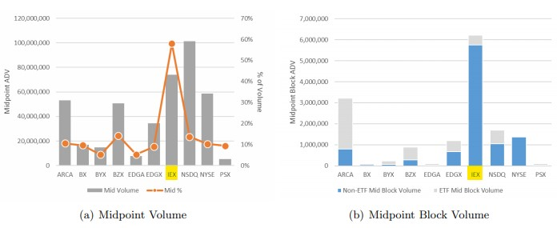
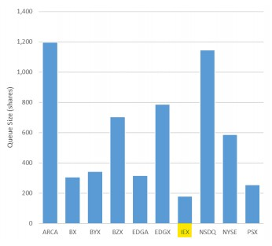
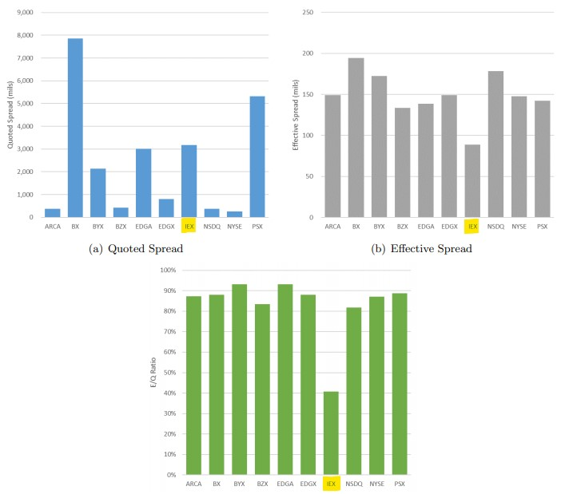

# FinTech Case Study - IEX Group


## Overview and Origin

* **Incorporated:**  2012

* **Founders:**  Brad Katsuyama & Ronan Ryan

* **Genesis of Business:** While working together on the global electronic trading team at Royal Bank of Canada, the founders discovered that the biggest stock exchanges were incentivizing predatory trading behaviour that was negatively impacting long-term, institutional investors that represented the savings of million of people.  The founders felt the best way to effect change was to create a new exchange where the interests of the investor came first.     

* **Funding:** To date the company has raised $100.9M over 5 rounds of funding.  Its largest investors include Spark Capital and Sapphire Ventures along with smaller investments made by a diverse group of institutional market participants.  

## Business Activities

### **Reshaping the Incentive Structure and Building Fairer Markets**

IEX aims to dismantle and re-engineer the incentive structure that most modern stock exchanges currently operate under.  Under this system, the exchanges incentivize liquidity providers to co-locate servers and deploy an ever increasing amount of computing power in an effort to shave thousandths of a millisecond off of trade times to exploit this speed incentive.  Ultimately, the actions of these market participants adversely affect institutional investors (who represent the 401k’s and pensions of millions of people) by obscuring true price discovery, depressing real liquidity and exacerbating periods of market instability.  

### **Target Market & Beneficiaries**

The only market participants that wouldn't benefit immensely from IEX's innovations and business model are predatory high-frequency traders that exploit structural deficiencies in the current market landscape.  

By promoting better price discovery, transparency, stability and quality liquidity true transaction costs will be lower for everybody.  Ultimately, IEX offers a truly level playing field for all market participants, something that competing exchanges, by the very nature of how they are set up, can not offer. 

### **Tools in the Arsenal - Innovations and Technology Used**

To combat the advantages that only “structural insiders” have access to, IEX has made numerous innovations in their effort to put all market participants on an equal footing:

#### *The IEX Signal a.k.a "The Crumbling Quote Indicator"*

> This is a predictive model that forecasts when the price of a stock is about to change.  By leveraging their massive speed advantage, high-frequency traders are able to forecast when prices are about to change drastically and "pick-off" slower participants, a form of latency arbitrage.  The IEX signal protects orders from getting picked off by pulling the order until the price changes.

#### *"The Speed Bump"*
>
>
>
>The speed bump is a 38-mile long fiber optic cable that slows down price information coming into and out of IEX by 350 microseconds.  This is an effort to mitigate the advantage that co-location of servers at exchange data processing centers offers high-frequency traders.  Often times these market participants will have quicker access to market information than the exchanges themselves.  

#### *IEX Cloud*

>Financial data sets are often messy and incomplete.  In addition to having to sort through vast amounts of data, participants that need information on different markets or parameters might have to access dozens of different APIs in order to find what they are looking for.  To solve this problem, IEX Cloud provides highly curated, scrubbed and organized financial data on stocks, forex and crypto all through one API.  The ultimate goal is to democratize access to quality financial data for everybody.
>
>*Sample API Code:*

```python
    curl 'https://cloud.iexapis.com/v1/stock/aapl/ohlc/?token={your_token}'
    {
        open: {
        price: 199.01,
        time: 1542033000818
    },
    close: {
        price: 204.47,
        time: 1541797200568
    },
    high: 199.85,
    low: 193.79
    }
```

#### *Rules Engine*
>
>As a subset of the Cloud platform, IEX has developed a "Rules Engine" tailored to users without coding experience.  Through an inutitive and simple interface users can build models and screens based on simple rules (eg. show me stocks whose price has increased >8% over the past 10 days whose PEG ratio is higher than 20).  By combining multiple data sets and handling all the computing and data storage in their cloud, users don't need to set up any storage infrastructure.

## Market Landscape:

* **Domain:** Investment Management - Equities Trading 

* **Trends and Innovations in this Area**

    Despite the specter of the 2010 “Flash Crash” looming over markets for the past 10 years;  little has been done to change or challenge the status quo.  The latency arms race rages on as entrenched firms with majority market share double-down on incentivizing practices that harm smaller investors (Case in point: [Competing wireless data transmission towers owned by two HFT vie for precious inches to get closer to the CME derivatives server in a small Chicago suburb](https://www.bloomberg.com/news/features/2019-03-08/the-gazillion-dollar-standoff-over-two-high-frequency-trading-towers)).

    According to co-founder Ronan Ryan, "All of the innovation in US equities in the last 10-15 years has been in dark trading."  With the thought process that lit markets (markets where the full size of the bid/offer is displayed) is better for everybody, IEX has launched the D-Limit order. The D-Limit, which is a derivative of their Crumbling Quote Indicator, offers even greater protection at the national best-bid best-offer (NBBO).  Using advanced predictive models based on artificial intelligence, it offers protection from latency arbitrage, which in turn offers greater security when posting lit quotes.  This embeded proteciton should encourge more market participants to post observable markets and stands as one of the more important innovations in this domain over the past decade.      


* **Major Players in Domain:** 

    | Old Guard      | New Comers |
    | -----------    | ----------- |
    | NYSE/ICE       | MEMX (Members Exchange)      |
    | Nasdaq         | LTSE (Long Term Stock Exchange)      |
    | CBOE           |    Clarity - Bidrate   |
    |                | BTS Spark       |

Two new alternative exchanges are opening up later this year, the MEMX (Members Exchange) and the LTSE (Long Term Stock Exchange).  Currently there are 13 approved US stock exchanges - five of them owned by the NYSE/ICE, four owned by Cboe Global Markets, three owned by the NASDAQ and the sole independently owned exchange being IEX.  

These two new entrants are targeting specific segments of the market: MEMX is a collaboration between Wall Streets biggest buy-side traders, aiming to lower the exorbitant fees charged by the big 3 exchanges and LTSE is targeting investors who take a long-term view on companies dedicated towards Enviromental, Social and Governance goals for corporate America.  Both exchanges, but specifically MEMX, will offer up a strong challenge to IEX as they are also targeting the cost aspect of trading.  

## Results

**Impact**

After peaking at a little over 2.5% in July of 2019, IEX currently has around 1.8%  of listed US equities market share.

   >

A lot of pundits have struggled to explain why IEX hasn't faired better since they got approval as a national securities exchange in 2016.  As the Financial Times stated in mid-2019:
        
   >>To some, it is a missed opportunity: a sign that the structures IEX hoped to dismantle have remained in place. The incumbent groups have retained their hegemony and HFTs still threaten to pick off the best prices from slower investors.
   >>       
   >>“I’m surprised [IEX’s] market share isn’t higher,” said Kevin Cronin, global head of trading for Invesco, the $955bn-in-assets firm based in Atlanta, who tried to hire Mr Katsuyama before he launched the exchange. “They have achieved a lot — but there’s a long way to go for IEX to achieve what many thought they would have.”  ([Source](https://www.ft.com/content/fc1a0d44-827a-11e9-b592-5fe435b57a3b))

One key underestimation the founders made was how much of the industry centered around exchanges paying for order flow.  IEX doesn't offer rebates to market makers based on how much they trade whereas most other exchanges do (See Chart Below).  For example, the exchange will credit traders on a monthly basis a certain amount of cents per share based on their overall trading volume for that month.  The allure of this credit has been too strong to pass up for a lot of traders.  Anecdotally, at a previous hedge fund I worked at (which wasn't even a HFT shop rather a derivatives focused fund that traded a lot of underlying stock to hedge their derivatives exposure) the equity desk received these rebates.  They viewed it as a way to cut down on their overall brokerage and exchange fees. 

>   

**Performance Metrics**

There are few widely accepted indicators used to evaluate the "market quality" of various exchanges.

* *Liquidity:* As mentioned above, IEX's market share, and therefore overall trading volume, is smaller compared to more established exchanges.  However, because these exchanges offer an incentive in the form of a rebate to provide liquidity, it is import to assess liquidity not just in terms of quantity but also the *quality* of that liquidity:

    * Midpoint Volume: Utilizing key innovations such as the *Crumbling Quote Indicator* and the speed bump, IEX has constructed a market that is very conducive to midpoint trading.  Because midpoint liquidity is not displayed, it is a useful way for investors to move large blocks of stocks without revealing their intention to buy or sell to the broader market.  Trades that occur at the midpoint are also cheaper because they don't have to cross the bid-ask spread.  For an exchange as small as IEX, the percentage of trades done at the midpoint are impressive:

        

    * Size of Queue: Another key metric in evaluating liquidity is the probability of execution.  The larger the size of the queue, the longer it will take for orders at the end of it to start getting filled.  IEX has one of the smaller queue sizes out of competing exchanges:

            

* *Quoted and Effective Spread:* The difference between the bid and offer prices is referred to as the quoted spread.  The effective spread looks at the midpoint of the bid/ask and compares it to the last executed trade.  Both of these indicators are a simple measure of calculating the cost of executing in a certain market.  IEX boasts the lowest effective spread out of any US equities market and the lowest Quoted/Effective spread ratio:

    

* *Market Stability:* Market Stability facilitates efficient price discovery, lower execution costs, and greater liquidity.  In simple terms it can be defined as the ability of the market to digest large volumes of stock without creating excess volatility in prices.  The largest component in market stability is the stability in the bid/ask spread.  Because IEX's market structure emphasises midpoint trading there is inherently less impact on the bid/ask spread, which in turn promotes liquidity and price improvement.
   

**Performance Relative to Competitors**

IEX has failed to gain substantial market share in US equities trading despite posting superior performance metrics versus competitors.  They briefly tried to get into the listing business, vying for a piece of the lucrative IPO market, but have since pulled out after only attracting one company (Interactive Brokers).  They continue to innovate on this side of the business, with approval for D-Peg orders (an evolution of their CQI) coming to market this year, in an effort to grow market share.  
 
Recently they have started to build out their suite of cloud applications with IEX Cloud and IEX Astral, leveraging their internal technology to provide data services to various financial companies.  While this is certainly a growth area in their domain, it has a lot more competitors than their exchange business.

## Recommendations

* The natural next step for IEX would be to list derivatives on the current stock symbols they offer.  I feel like all of the innovations they have pioneered are even more impactful when applied to options trading.  It is a natural corollary, as the price of an option is derived from the underlying stock price. When low latency traders can anticipate and subsequently cause quick and drastic changes in the underlying price, they can also pick off stale or slow options orders as well. 

If you apply the technology behind the CQI, D-limit order and other latency arbitrage protections, you could create a very robust and competitive derivatives market.  Not only would market makers and traders benefit immensely from this market structure, but brokers who are filling orders for clients would find it incredibly attractive.  

A client might not care if he gets a broker fill for a stock that is a penny worse than expected but because of the inherent leverage in options (especially so for options trades where the trader is hedging the delta with underlying stock) clients are way more sensitive to the quality of the fill.  With these protections in place, an IEX derivatives exchange would be the easy choice for brokers filling very price sensitive options orders and all other market participants alike. 

* Because the impact of their current technology and innovation would be magnified when applied to derivatives trading, I believe they would have an easier time competing with the established giants in this domain and quickly gain meaningful market share.  Furthermore, options fees and pricing is much higher than underlying stock, driving more revenue to their bottom line.

* The beauty of this expansion is that all of the technology (machine learning, algorithms, artificial intelligence) already exists and can be scaled easily to derivatives trading.  Regulatory hurdles aside, I expect them to announce an entry into this field at some point in the near future as it makes a lot of sense.     


>## *Research Notes:*
>
>* https://www.crunchbase.com/organization/iex
>* https://en.wikipedia.org/wiki/IEX
>* https://iextrading.com/
>* Flash Boys: A Wall Street Revolt, Michael Lewis
>* https://iextrading.com/docs/The%20Evolution%20of%20the%20Crumbling%20Quote%20Signal.pdf
>* https://youtu.be/-a10cCR9HoM
>* https://iexcloud.io/
>* https://www.bloomberg.com/news/features/2019-03-08/the-gazillion-dollar-standoff-over-two-high-frequency-trading-towers
>* https://ideas.darden.virginia.edu/innovations-for-fairer-markets-in-the-era-of-high-frequency-and-algorithmic-trading
>* https://www.ft.com/content/fc1a0d44-827a-11e9-b592-5fe435b57a3b
>* https://iextrading.com/docs/A%20Comparison%20of%20Execution%20Quality%20across%20U.S.%20Stock%20Exchanges.pdf
>* https://www.tradersmagazine.com/am/the-iex-d-limit-proposal-its-goodbut-what-if-its-too-good/
>* https://www.fastcompany.com/company/iex
>* https://iextrading.com/about/press/op-ed-3/
>* https://www.cnbc.com/2020/09/09/a-spate-of-new-stock-exchanges-are-ready-to-launch-that-want-to-compete-for-your-trading-dollar.html
>* https://www.marketsmedia.com/more-innovation-ahead-in-us-displayed-markets/


